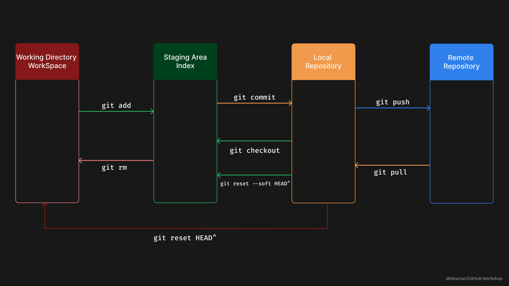

# Git & GitHub Workshop (Mar, 2023)


# Table of Contents

- [Introduction](#introduction)
- [What is Git?](#git-is-a-version-control-system)
- [Git vs GitHub](#git-vs-github)
- [Git Setup and Configuration](#git-setup-and-configuration)
- [Demo Repository Setup](#demo-repository-setup)
- [Staging Area Concept in Git](#staging-area-concept-in-git)
- [Add and Commit [Local Repo]](#add-and-commit-local-repo)
- [Git Collaboration](#git-collaboration)

# Introduction

Welcome to the Git & GitHub Workshop! This workshop is designed to introduce you to the basics of Git and GitHub. Git is a version control system that allows you to track changes to your code and collaborate with others. GitHub is a web-based hosting service for version control using Git.

# Git is a Version Control System

- Version control is a system that records changes to a file or set of files over time so that you can recall specific versions later.

- Git is a version control system that allows you to track changes to your code and collaborate with others.

# **Git vs GitHub**

| Git                                                                    | GitHub                                                                                |
| ---------------------------------------------------------------------- | ------------------------------------------------------------------------------------- |
| Tool to control and track versions of code.                            | Cloud service to host git repositories.                                               |
| Installed and maintained locally on a developer's computer.            | Remote connection provider and maintained on cloud/web.                               |
| Generally uses command line interface (CLI) with a limited GUI.        | Provides a graphical user interface (GUI) to interact with git repositories.          |
| Allows for branching and merging of code.                              | Offers pull requests and code review features for collaboration.                      |
| Provides basic features like committing changes and creating branches. | Offers additional features like issue tracking, project management, and code hosting. |

# Git Setup and Configuration

1. Download and install Git from [https://git-scm.com/downloads](https://git-scm.com/downloads)

2. Open Git Bash and check the version of Git installed:

```bash
git --version
```

3. Configure Git with your name and email address:

```bash
git config --global user.name "Your Name"
git config --global user.email "Your Email"
```

# Demo Repository Setup

1. Create a New Folder on your Desktop called `yourFolderName`:

2. Open Git Bash and navigate to the folder you just created:

```bash
cd yourFolderName
```

3. Initialize the folder as a Git repository:

```bash
git init
```

4. If you didnot setup global configuration, you can configure Git with your name and email address:

```bash
git config user.name "Akib Zaman"
git config user.email "your@email.here"
```

You can also check the configuration:

```bash
git config --list
```

Check Global Email and Name:

```bash
git config user.email
git config user.name
```

5. Create some files in the folder:

```bash
touch file1.txt
touch file2.txt
```

6. Check the status of the repository:

```bash
git status
```

7. Let’s add the new file to staging Area

# Staging Area Concept in Git



# Add and Commit [Local Repo]

### Adding to the Staging Area:

1. Only a specific File: `git add <file_name>`

2. Only files of a folder but not the subfolder: `git add .` or `git add *`

3. All files and subfolders recursively: `git add -A`

4. Only a particular type of file from directory: `git add *.c`

5. Only a particular type of file from directory & subdirectory: `git add **/*.c`

### Checking the Differences between previous and current version: `git diff`

### Restore the earlier version of the file: `git restore < file_name>`

### Removing from Staging Area: `git restore --staged <file_name>`

### Committing to the Local Repository:

1. Only Commit: `git commit -m "Your Commit Message"`
2. Commit and Add: `git commit -am "Your Commit Message"`
3. Commit and Add with Editor: `git commit -a`
4. See Commit History: `git log` or for a short version: `git log --oneline` or for a short version with graph: `git log --oneline --graph`
5. See Commit History with Author: `git log --oneline --graph --all --decorate --author="Akib Zaman"`

6. See Specific Commit: `git show <commit_id>`

### Undoing from Local Repository:

1. Local Repo to Staging Area: `git restore --staged <file_name>`

2. Local Repo to Staging Area (Multiple Commit): `git reset --soft HEAD~<number_of_commit>` e.g. `git reset --soft HEAD~2`

3. Local Repo to Working Directory: `git restore <file_name>`

4. Total Deletion of a Commit: `git reset --hard HEAD^

### Checkout

1.  To a specific commit: `git checkout <commit_id>`

2.  To a specific branch: `git checkout <branch_name>`

3.  To a specific tag: `git checkout <tag_name>`

4.  Move back to the previous branch: `git checkout -`

### Branching

1.  Create a new branch: `git branch <branch_name>`
2.  List all branches: `git branch`
3.  Switch to a branch: `git checkout <branch_name>`
4.  Create a new branch and switch to it: `git checkout -b <branch_name>`
5.  Delete a branch: `git branch -d <branch_name>`
6.  Merge a branch: `git merge <branch_name>`
7.  Merge a branch with a commit message: `git merge <branch_name> -m "Your Commit Message"`

## Git Collaboration

1.  Create a new repository on GitHub
2.  Copy the remote repository URL
3.  Add the remote repository URL to your local repository: `git remote add origin <remote_repository_URL>`

4.  Clone a Remote Repository: `git clone <remote_repository_URL>`

5.  Push to Remote Repository: `git push -u origin`

6.  Pull from Remote Repository: `git pull`

7.  Fetch from Remote Repository: `git fetch`

8.  Push setting the branch upstream: `git push --set-upstream origin <branch_name>`

## Extra Resources

- [Akib Zaman's PDF](https://github.com/akibzaman/GitHub-Workshop/blob/main/Git_Manual.pdf)

- [Git Cheat Sheet](https://education.github.com/git-cheat-sheet-education.pdf)
- [Git Documentation](https://git-scm.com/doc)
- [Git Branching](https://learngitbranching.js.org/)
- [Git Immersion](https://gitimmersion.com/)
- [Git for Teams](https://www.atlassian.com/git/tutorials/comparing-workflows/gitflow-workflow)
